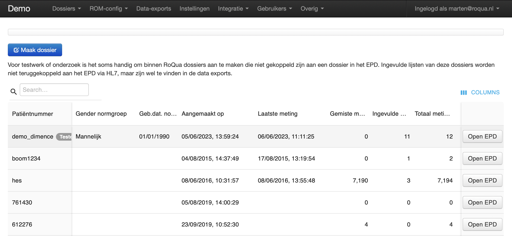
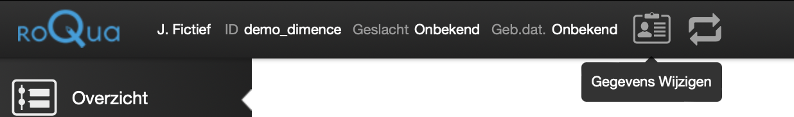

# Dossiers

## Ongekoppelde dossiers

Op deze pagina bevindt zich een tabel met de deelnemers van het project. Door
op de tabelkoppen te klikken kan de tabel gesorteerd worden. Daarnaast is het
mogelijk om door de tabel te zoeken, waarbij door data van meerdere kolommen
gezocht kan worden. De voornaam, achternaam en e-mailadres-kolommen zijn standaard verborgen, maar kunnen worden aangezet via de knop "Columns".

Klik op "Open EPD" om het dossier te openen. Binnen het dossier kunnen vragenlijsten worden klaargezet, protocollen worden gestart en uitkomsten worden ingezien.

### Statistieken

Rechts in de tabel zijn drie statistieken opgenomen:

* **Gemiste Metingen** geeft aan hoeveel metingen er gemist zijn
* **Ingevulde Metingen** geeft aan hoeveel er ingevuld zijn
* **Totaal Metingen** geeft aan hoeveel metingen er in totaal klaargezet zijn

## Maak dossier

Met de "Maak dossier" knop kunt u nieuwe dossiers toevoegen. Op het scherm dat volgt kunnen de persoonsgegevens en het onderzoeksnummer worden ingevuld. De persoonsgegevens vallen niet door in de CSV data exports, het onderzoeksnummer wel.

## Gegevens aanpassen

Na het aanmaken van een dossier kunnen de gegevens worden aangepast door het dossier te openen en bovenin op de "Gegevens wijzigen" knop te klikken.

## Vragenlijsten, protocollen en uitnodigingen beheren

Vragenlijsten en protocollen klaarzetten of uitnodigingen versturen doet u via
[RoQua](../../rom_manual/epd/). RoQua wordt ingeladen via de pagina 'Deelnemer weergeven'.
Druk op **Open EPD** om de EPD-weergave voor deze deelnemer te openen.
