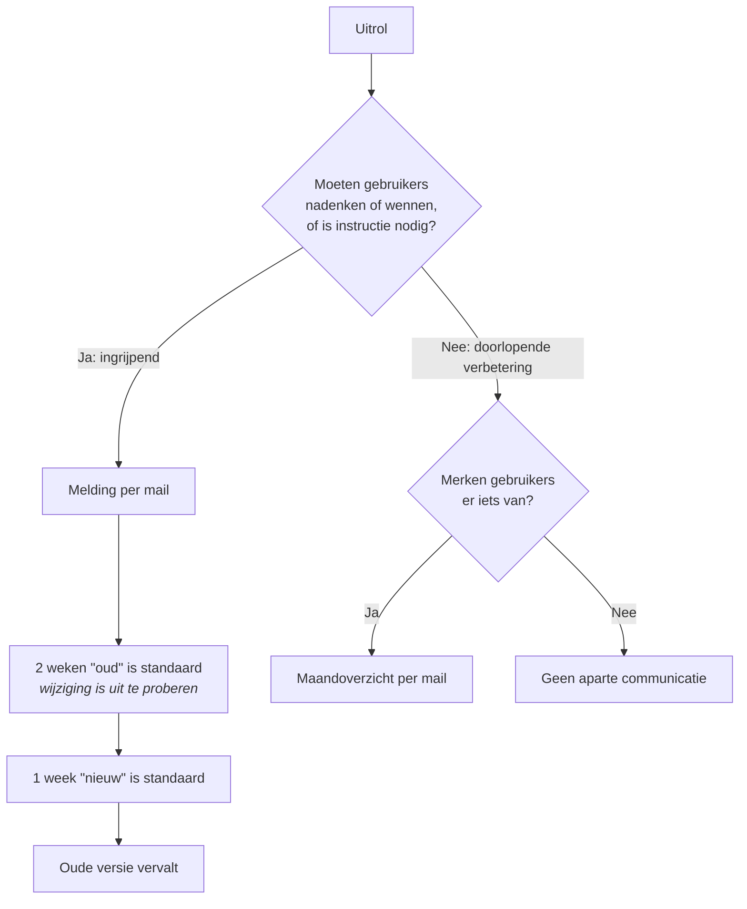

:::caution[Status]
Dit beleid is nog een concept. Ook de ondersteunende techniek is nog in aanbouw: de release notes zijn inmiddels zichtbaar in de RoQua Admin, maar het versturen van e-mails (aankondigingen en het maandoverzicht) en het bijbehorende contactbeheer zijn nog niet gereed.
:::

Dit document beschrijft hoe RoQua wijzigingen uitrolt en daarover communiceert met klantorganisaties. Het gaat over de applicaties die eindgebruikers en functioneel beheerders zien; interne infrastructuurwijzigingen zonder gebruikerseffect vallen erbuiten.

## Uitgangspunt: hoe RoQua releaset

RoQua werkt niet met grote periodieke releases, maar rolt wijzigingen regelmatig in kleine stappen uit. Elke wijziging wordt door een tweede ontwikkelaar beoordeeld en doorloopt vóór uitrol een uitgebreide geautomatiseerde testsuite. Kleine stappen betekenen: klein risico per stap voor onze klanten, en als er toch iets misgaat, is de oorzaak snel gevonden en hersteld. Dit is ook terug te zien in de werkelijkheid: er zijn soms wel storingen, maar die zijn zelden het gevolg van een uitrol van een nieuwe softwareversie.

## Soorten wijzigingen

We onderscheiden een aantal verschillende soorten wijzigingen in de applicatie, elk met een eigen aanpak. Hieronder een kort overzicht, in de secties daaronder gaan we uitgebreider in op de werkwijze per soort wijziging. 

| Soort | Wat | Communicatie |
|---|---|---|
| **Ingrijpende wijzigingen** | Nieuwe of vernieuwde schermen/functionaliteit waar gebruikers over moeten nadenken of aan moeten wennen, of waar instructie of training bij kan horen | Melding direct na uitrol met informatie over het migratietraject |
| **Doorlopende verbeteringen** | Zichtbare aanpassingen waar gebruikers zonder instructie of gewenning mee verder kunnen | Maandoverzicht per e-mail |
| **Bugfixes, LCM** | Herstel van fouten, technisch onderhoud (bibliotheek- en platformupdates) | In het maandoverzicht als gebruikers er iets van merken; anders stil |
| **Koppelvlakwijzigingen** | Wijzigingen aan HL7, FHIR of API's — altijd backwards-compatible: bestaande koppelingen blijven werken | Rechtstreeks overleg met de koppelende partijen; nieuwe route komt naast de oude, de oude vervalt pas als alle partijen over zijn |
| **Vragenlijstwijzigingen** | Eigen releaseproces en cadans (zie hieronder) | Eigen release notes in de applicatie; ook opgenomen in het maandoverzicht |

### Ingrijpende wijzigingen

Onder ingrijpende wijzigingen verstaan we nieuwe of vernieuwde schermen of functionaliteit waar gebruikers over moeten nadenken of aan moeten wennen, of waar instructie of training bij kan horen. Wanneer een uitrol van RoQua een ingrijpende wijziging bevat, dan gaat hierover een mail naar de contactpersonen van de organisatie op het moment van uitrol.

Zo'n ingrijpende wijziging rollen we gefaseerd uit:

1. **Vanaf de uitrol: uitproberen (opt-in), 2 weken.** De nieuwe versie is beschikbaar naast de oude. Gebruikers kunnen zelf overstappen (op het oude scherm staat ergens een knopje "probeer de nieuwe versie"), en ze kunnen ook weer terug naar de oude versie. Functioneel beheer kan in deze periode schermafbeeldingen en instructiemateriaal maken en de eigen organisatie informeren — de rest van de organisatie merkt nog niets.
2. **Daarna: nieuw is standaard (opt-out), 1 week.** Iedereen krijgt standaard de nieuwe versie te zien; wie tegen een probleem aanloopt, kan tijdelijk terug naar de oude versie en meldt het probleem via de helpdesk.
3. **Daarna: oude versie vervalt.**

Deze termijnen (2 + 1 weken) zijn de standaard; waar nodig plannen we ruimer. De precieze datums staan in de aankondiging aangegeven. En als er problemen zijn, schuiven de datums op; dat melden we via hetzelfde kanaal als de aankondiging.

Normaal gesproken laten we gebruikers zelf de opt-in/out doen, dan kan iedereen een handig moment kiezen. Er zijn wijzigingen denkbaar waarbij het niet handig is dat verschillende gebruikers verschillende interfaces zien, dan kan het een vinkje zijn dat functioneel beheer in de admin instelt. Wijzigingen zichtbaar voor cliënten zullen in elk geval op die manier gaan, we laten niet de cliënt zelf tussen versies springen. 

Incidenteel kan het voorkomen dat het technisch niet mogelijk is om beide versies naast elkaar te hebben. In dat geval komt de aankondiging, met schermafbeeldingen, 2 weken voordat de wijziging uitgerold gaat worden op productie en zorgen we dat het op dat moment al beschikbaar is op de acceptatieomgeving. De uitrol op productie gebeurt dan op de aangekondigde datum, en de overgangsperiode vervalt.

Volledig nieuwe functionaliteit zonder bestaande voorganger kent geen overgangsperiode; die kondigen we aan en activeren we op de genoemde datum. We beperken het aantal wijzigingen dat tegelijk in een overgangsperiode zit, zodat helpdesk en documentatie bij te houden zijn.

:::note[Wanneer is een wijziging ingrijpend?]
In de basis is een wijziging ingrijpend wanneer hij de werkwijze van gebruikers zó verandert dat ze moeten nadenken of wennen om de nieuwe versie te kunnen gebruiken. Een aanpassing die strikt genomen de werkwijze raakt maar waar iedereen zonder uitleg mee verder kan, valt onder de doorlopende verbeteringen. Nieuwe functies zijn meestal niet ingrijpend (als je gewoon niet naar die pagina gaat merk je er verder niets van), een extra formulierveld in een bestaande pagina ook meestal niet, maar een herontwerp van een scherm kan dat wel zijn.

Wijzigingen die alleen impact hebben op de RoQua Admin-omgeving, en dus alleen voor beheerders en coördinatoren merkbaar zijn, zullen we eerder als doorlopende verbetering bestempelen. Het heeft geen zin om coördinatoren tijd te geven om een overstap te begeleiden die ze zelf moeten maken tenslotte.

Zo'n indeling blijft uiteindelijk een inschatting: wat voor de ene organisatie een kleine aanpassing is, kan voor de andere een ingesleten werkwijze raken. Vind je als coördinator dat we een wijziging te licht (of juist te zwaar) hebben ingeschat, dan horen we dat graag via de helpdesk — die terugkoppeling nemen we mee bij de indeling van volgende wijzigingen.
:::

### Doorlopende verbeteringen

Doorlopende verbeteringen zijn zichtbare aanpassingen waar gebruikers zonder instructie of gewenning mee verder kunnen. Dat kan een kleine wijziging in de interface zijn die van zichzelf duidelijk genoeg is, of een verbetering van de werking van een scherm. Doorlopende verbeteringen worden direct uitgerold; er is geen overgangsperiode. Als gebruikers er iets van merken, nemen we het op in het maandoverzicht per e-mail.

### Bugfixes &amp; life-cycle management

Bugfixes zijn herstel van fouten, en life-cycle management (LCM) is technisch onderhoud zoals bibliotheek- en platformupdates. Bugfixes en LCM worden direct uitgerold; er is geen overgangsperiode. Als gebruikers er iets van merken, nemen we het op in het maandoverzicht per e-mail. 

Security fixes worden indien nodig gecommuniceerd via de CISO van uw organisatie.

### Koppelvlakwijzigingen

Wijzigingen aan HL7, FHIR of API's zijn altijd backwards-compatible: bestaande koppelingen blijven werken. Als we toch wijzigingen willen doorvoeren die niet backwards-compatible zijn, communiceren we dat tijdig met de betrokken partijen. Nieuwe routes komen naast de oude, en de oude route vervalt pas als alle partijen over zijn.

De SQLite exports van RoQua zijn eveneens backwards-compatible: de kolommen in de export blijven bestaan, en nieuwe kolommen worden toegevoegd. Als we een wijziging willen doorvoeren die niet backwards-compatible is, brengen we hiervoor eerst een nieuwe versie uit parallel naast de oude, en de oude versie vervalt pas na een overgangsperiode en in overleg met de betrokken partijen.

De CSV exports van RoQua zijn niet backwards-compatible: kolommen kunnen vervallen. In de praktijk komt dit echter zeer zelden voor. Ook bevat de export documentatie over de kolommen en hun betekenis, en scripts waarmee het huidige formaat in SPSS ingelezen kan worden. RoQua verwacht van betrokken partijen dat ze werken op basis van kolomnaam, niet kolompositie, zodat het invoegen van een extra kolom geen probleem is.

### Vragenlijsten

Vragenlijstwijzigingen staan los van software-uitrol: ze hebben hun eigen releaseproces en een eigen cadans — vragenlijst-updates komen zelfs vaker uit dan softwarewijzigingen. Aanpassingen gebeuren vrijwel altijd op verzoek van een klant; gevalideerde instrumenten worden niet inhoudelijk aangepast. Elke vragenlijstwijziging doorloopt een dubbele review (inhoudelijk én op scoring). Vragenlijsten hebben eigen release notes, die nu al in de applicatie zichtbaar zijn; die nemen we voortaan ook mee in het maandoverzicht.

## Communicatie en contactbeheer

- **Alle release notes zijn direct na uitrol te lezen** in de applicatie. Wie wil, kan dus altijd meteen zien wat er veranderd is.
- **Ingrijpende wijzigingen mailen we direct bij de start van de uitrol.**
- Doorlopende verbeteringen, bugfixes en vragenlijst-updates bundelen we in het maandoverzicht per e-mail (dat alleen verschijnt als er iets te melden is).
- **Verzonden release notes passen we achteraf niet stilletjes inhoudelijk aan.** Typefouten verbeteren we direct; inhoudelijke wijzigingen — zoals een verschoven datum — voegen we toe als gedateerde updateregel aan de release note ("Update [datum]: …") en versturen we opnieuw.
- In de RoQua Admin bouwen we een nieuw scherm waarin functioneel beheer zelf de lijst van e-mailadressen beheert die onze releasecommunicatie ontvangen — wie in de lijst staat, krijgt zowel de aankondigingen van ingrijpende wijzigingen als het maandoverzicht. Dit doen we los van gebruikers-accounts, zodat je ook een gedeelde mailbox of helpdesk-adres kunt opgeven. De beheerpagina toont wie binnen jullie organisatie de mails ontvangt — de organisatie is er zelf verantwoordelijk voor dat de lijst niet leeg raakt.
