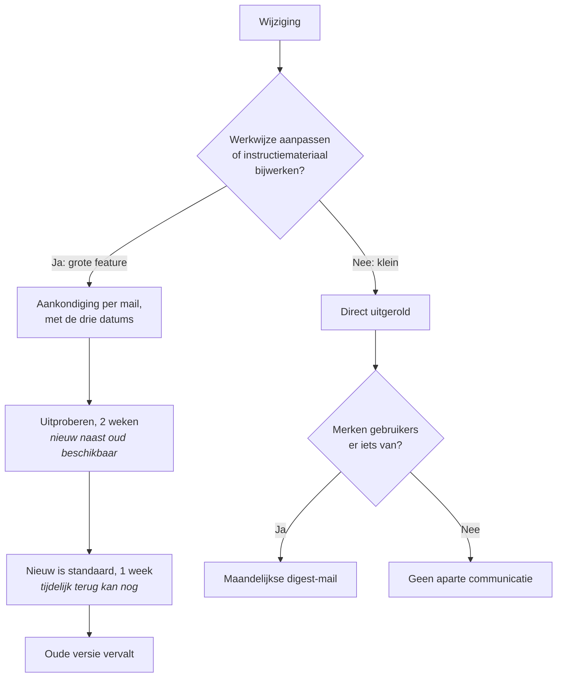

Dit document beschrijft hoe RoQua wijzigingen uitrolt en daarover communiceert met klantorganisaties. Het gaat over de applicaties die eindgebruikers en functioneel beheerders zien; interne infrastructuurwijzigingen zonder gebruikerseffect vallen erbuiten.

## Uitgangspunt: hoe RoQua releaset

RoQua werkt niet met grote periodieke releases, maar rolt wijzigingen doorlopend in kleine stappen uit - meestal een of enkele keren per week. Elke wijziging wordt door een tweede ontwikkelaar beoordeeld en doorloopt vóór uitrol een uitgebreide geautomatiseerde testsuite. Kleine stappen betekenen: klein risico per stap voor onze klanten, en als er toch iets misgaat is de oorzaak snel gevonden en hersteld. Het halfjaarlijkse "grote release"-risico dat je wellicht van andere leveranciers kent, bestaat in dit model niet. Dit is ook terug te zien in de werkelijkheid: er zijn soms wel storingen, maar die zijn zelden het gevolg van een uitrol van een nieuwe softwareversie.

## Soorten wijzigingen

We onderscheiden een aantal verschillende soorten wijzigingen in de applicatie, elk met een eigen aanpak:

| Soort | Wat | Communicatie |
|---|---|---|
| **Grote features** | Nieuwe of vernieuwde schermen/functionaliteit die gebruikers merken en waar instructie of training bij kan horen | Aankondiging per mail bij start van de uitrol, met de datums hieronder |
| **Kleine verbeteringen** | Zichtbare maar kleine aanpassingen die geen instructie vergen | Maandelijkse digest-mail |
| **Bugfixes, LCM** | Herstel van fouten, technisch onderhoud (bibliotheek- en platformupdates) | In de digest als gebruikers er iets van merken; anders stil |
| **Vragenlijstwijzigingen** | Eigen releaseproces en cadans (zie hieronder) | Eigen release notes in de applicatie; ook opgenomen in de digest |

En nog één vaste afspraak: **koppelingen blijven werken.** Wijzigingen aan koppelvlakken (HL7, FHIR, API's) zijn altijd backwards-compatible. De aanpak is: nieuwe route ernaast neerzetten, oude deprecaten, overleggen met de partijen die de koppelingen gebruiken, en de oude route pas verwijderen zodra alle partijen over zijn.

## Wat is groot of klein?

De grens tussen "groot" en "klein" bepalen we met deze toets: **moeten gebruikers hun werkwijze aanpassen, of moet functioneel beheer instructiemateriaal of training bijwerken?** Zo ja, dan is het een grote feature. 

Wijzigingen die alleen impact hebben op de RoQua Admin-omgeving, en dus alleen voor beheerders en coördinatoren merkbaar zijn, zullen we eerder als "klein" bestempelen.

De indeling wordt bepaald door de ontwikkelaar bij de wijziging zelf en gecontroleerd in de collegiale review; bij twijfel kiezen we de zwaardere categorie. 

## Uitrol van grote features

Waar een grote feature een bestaand scherm vervangt, rollen we uit via een overgangsperiode met drie vaste datums, die alle drie in de aankondiging staan:

1. **Vanaf de aankondiging: uitproberen (opt-in), 2 weken.** De nieuwe versie is beschikbaar naast de oude. Gebruikers kunnen zelf overstappen ("probeer de nieuwe versie") en terug. Functioneel beheer kan in deze periode schermafbeeldingen en instructiemateriaal maken en de eigen organisatie informeren — de rest van de organisatie merkt nog niets.
2. **Daarna: nieuw is standaard (opt-out), 1 week.** Iedereen krijgt de nieuwe versie; wie tegen een probleem aanloopt kan tijdelijk terug naar de oude versie en meldt het probleem via de helpdesk.
3. **Daarna: oude versie vervalt.**

Deze termijnen (2 + 1 weken) zijn de standaard; bij zeer ingrijpende wijzigingen kunnen we ruimer plannen — de aankondiging is altijd leidend. 

Afhankelijk van de aard van de feature verloopt de keuze per individuele gebruiker of per organisatie (instelbaar door functioneel beheer).  Wijzigingen aan de cliëntomgeving (de inlogpagina, de pagina's voor het invullen van vragenlijsten) gaan per organisatie, we laten niet de cliënt zelf tussen versies springen. 

Incidenteel kan het voorkomen dat het technisch niet mogelijk is om beide versies naast elkaar te hebben, in dat geval komt de aankondiging, met schermafbeeldingen, 2 weken voordat de wijziging uitgerold gaat worden.

Volledig nieuwe functionaliteit zonder bestaande voorganger kent geen overgangsperiode; die kondigen we aan en activeren we op de genoemde datum. We beperken het aantal features dat tegelijk in een overgangsperiode zit, zodat helpdesk en documentatie bij te houden zijn.

**Bij problemen** schuiven de datums op; dat melden we via hetzelfde kanaal als de aankondiging.

## Vragenlijsten

Vragenlijstwijzigingen staan los van software-uitrol: ze hebben hun eigen releaseproces en een eigen cadans — vragenlijst-updates komen zelfs vaker uit dan softwarewijzigingen. Aanpassingen gebeuren vrijwel altijd op verzoek van een klant; gevalideerde instrumenten worden niet inhoudelijk aangepast. Elke vragenlijstwijziging doorloopt een dubbele review (inhoudelijk én op scoring). Vragenlijsten hebben eigen release notes, die nu al in de applicatie zichtbaar zijn; die nemen we voortaan ook mee in de maandelijkse e-mail.

## Communicatie en contactbeheer

- **Alle release notes zijn direct na uitrol te lezen** in de applicatie (tot die functie er is: op https://docs.roqua.net/changelog/roqua/production). Wie wil, kan dus altijd meteen zien wat er veranderd is.
- **Grote features mailen we direct bij de uitrol.**
- Kleine verbeteringen, bugfixes en vragenlijst-updates bundelen we in de maandelijkse digest e-mail (die alleen verschijnt als er iets te melden is).
- **Verzonden aankondigingen passen we achteraf niet stilletjes inhoudelijk aan.** Typefouten verbeteren we direct; inhoudelijke wijzigingen — zoals een verschoven datum — voegen we toe als gedateerde updateregel aan de release note ("Update [datum]: …") en versturen we opnieuw.
- In de RoQua Admin bouwen we een nieuw scherm waarin functioneel beheer zelf de lijst van e-mailadressen beheert die onze releasecommunicatie ontvangen — wie in de lijst staat, krijgt zowel de aankondigingen van grote features als de maandelijkse digest. Dit doen we los van gebruikers-accounts, zodat je ook een gedeelde mailbox of helpdesk-adres kunt opgeven. De beheerpagina toont wie binnen jullie organisatie de mails ontvangt — de organisatie is er zelf verantwoordelijk voor dat de lijst niet leeg raakt.

## Verantwoordelijkheden

| Wie | Wat |
|---|---|
| Ontwikkelteam RoQua | Schrijft bij elke gebruikerszichtbare wijziging een release note en bepaalt daarbij de categorie, beide gecontroleerd in de collegiale review (bij twijfel de zwaardere categorie); stelt aankondigingen en digest op; bewaakt de uitroldatums |
| Functioneel beheer klant | Beheert de contactlijst van de eigen organisatie; gebruikt de opt-in-periode voor instructiemateriaal en interne aankondiging |
| Helpdesk RoQua | Neemt probleemmeldingen tijdens de overgangsperiode aan; kan aanleiding zijn om datums op te schuiven |

## Bewijs van naleving

*(na implementatie invullen in evidence-index)* Beoogd: release-note-files met PR-reviewhistorie; deploylog (DB-records met deploydatum); verzonden aankondigingen/digests; logging van flag-omzettingen.

## Ingangsdatum

Dit beleid gaat in na de feedbackronde met de coördinatoren en vaststelling. De ondersteunende techniek (digest-mail, contactbeheer, in-app notes) bouwen we in de maanden daarna; je ontvangt bericht zodra die live gaat. Tot die tijd blijven de huidige release notes op https://docs.roqua.net/changelog/roqua/production bestaan.
